# Multi-Agent Systems (Brevitas)

A focused toolkit and collection of experiments for researching multi-agent AI systems, communication protocols, and token-efficiency techniques.

This repository bundles a local demo environment, benchmarks, and the `token_efficiency_model` library used to measure and reduce redundant token transmission in agent chains.

**Contents**
- `default_testing/` — interactive React demo and token dashboard
- `token_efficiency_model/` — core Python libraries, samplers, compressors, and pipelines
- `eval/` & `eval_runs/` — evaluation pipelines and sample run outputs

**Quick Start**

1. Run the React demo (local Ollama recommended):

```bash
cd default_testing
npm install
npm run dev
```

2. Use the Python experiments and benchmarks:

```bash
source .venv/bin/activate
python -m token_efficiency_model.experiments.run_simulation
```

**High-Level Goals**
- Demonstrate how sequential agent chains generate redundant tokens and measure cost/efficiency.
- Provide modular tooling to experiment with compression, shared-memory middleware, and routing strategies.
- Offer reproducible experiments and visual dashboards for analysis.

**Architecture Overview**

```mermaid
flowchart LR
	User[User / Task] --> A(Architect Agent)
	A --> B(Builder Agent)
	B --> C(Reviewer Agent)
	C --> Result[Final Result]
	subgraph Middleware
		M[Token Efficiency Pipeline]\n(compression, recall, routing)
	end
	A --- M
	B --- M
	C --- M
	M --> Result
```

This diagram highlights the canonical sequential flow (Architect → Builder → Reviewer) with an optional middleware pipeline that can reduce redundant tokens via compression, selective recall, or routing.

---

**Detailed Token Efficiency Pipeline Flow**

The diagram below shows exactly what happens to a task from the moment it enters the pipeline to the moment the model is called. Each stage reduces the token footprint of the payload while protecting critical context.

```mermaid
flowchart TD
    Task([Incoming Task + Messages + Prior Context])

    subgraph ROUTE["1 · Task-Aware Routing"]
        R1{Score task\ncomplexity · urgency\ncontext_load}
        R2[Small Model\nllama-small]
        R3[Large Model\nllama-large]
        R1 -->|score < 0.48| R2
        R1 -->|score ≥ 0.48| R3
    end

    subgraph COMPRESS["2 · Agent Communication Compression"]
        C1[Split all messages\ninto sentences]
        C2[Cluster by\nlexical overlap]
        C3{Anchor word\nin cluster?\ne.g. critical · error\ndecision · todo}
        C4[Keep anchor\nsentence as-is]
        C5[Collapse cluster →\ntop-4 token summary]
        C1 --> C2 --> C3
        C3 -->|yes| C4
        C3 -->|no| C5
    end

    subgraph SAMPLE["3 · Adaptive Semantic Sampling"]
        S1[Score each context chunk]
        S2["Relevance 35%\n(Jaccard vs task keywords)"]
        S3["Frequency 25%\n(concept recurrence)"]
        S4["Recency 20%\n(exponential decay)"]
        S5["Entropy 20%\n(unique info content)"]
        S6[Novelty re-rank:\nmaximise diversity\nacross selected set]
        S7[Always preserve:\nmost recent chunk +\nhighest-scoring chunk]
        S1 --> S2 & S3 & S4 & S5
        S2 & S3 & S4 & S5 --> S6 --> S7
    end

    subgraph PRUNE["4 · Smart Context Pruning"]
        P1[Re-score sampled chunks\nagainst task text]
        P2["Relevance 55% · Uniqueness 20%\nRecency 15% · Length 10%"]
        P3[Keep top-budget chunks\ndrop the rest]
        P1 --> P2 --> P3
    end

    subgraph MEMORY["5 · Shared Memory Layer"]
        M1{Chunk already\nin store?}
        M2[Send reference ID\nmem:sha1…]
        M3[Store chunk +\nsend inline]
        M4{Delta mode on\n+ prior snapshot\nexists?}
        M5[Compute delta_ops\nonly changed fields]
        M6[Full state payload]
        M1 -->|yes| M2
        M1 -->|no| M3
        M3 --> M4
        M4 -->|yes| M5
        M4 -->|no| M6
    end

    subgraph PROTOCOL["6 · Compact Wire Protocol"]
        W1["Shorten field names\ntask_id→t · context_refs→c\ninstructions→i · delta_ops→d …"]
        W2{Wire mode?}
        W3[JSON: compact\nserialised string]
        W4[Binary: zlib compress\n+ base64 encode]
        W1 --> W2
        W2 -->|json| W3
        W2 -->|binary| W4
    end

    subgraph TUNE["7 · Auto-Tuning Loop  max 3 attempts"]
        T1{Savings target\nreached AND\nquality ≥ floor?}
        T2[Accept config]
        T3[Increase compression\n+ tighten prune budget]
        T4{Quality below\n0.98 floor?}
        T5[Force full rehydrate\nrehydrate_policy = force-full]
        T1 -->|yes| T2
        T1 -->|no| T3 --> T1
        T2 --> T4
        T4 -->|yes| T5
        T4 -->|no| ModelCall
    end

    subgraph RL["8 · RL / MoE Orchestrator  learns across runs"]
        RL1[Discretise state\ncomplexity · urgency\ncontext_load · cache_hit · continuity]
        RL2[Q-table lookup\nper expert type]
        RL3[Pareto frontier\nselection: best savings\nwithout quality loss]
        RL4[ε-greedy exploration\nto discover better configs]
        RL5[Update Q-values\nafter each run]
        RL1 --> RL2 --> RL3
        RL3 -->|exploit| ModelCall
        RL3 -->|explore ε| RL4 --> ModelCall
        ModelCall --> RL5
    end

    ModelCall([Model Call + Response])
    Snapshot[Save state snapshot\nfor next turn delta]
    Result([Final Result + Token Savings Report])

    Task --> ROUTE
    ROUTE --> COMPRESS
    COMPRESS --> SAMPLE
    SAMPLE --> PRUNE
    PRUNE --> MEMORY
    MEMORY --> PROTOCOL
    PROTOCOL --> TUNE
    TUNE --> RL
    RL --> ModelCall
    ModelCall --> Snapshot
    Snapshot --> Result
```



**What each stage saves**

| Stage | Mechanism | Typical savings |
|---|---|---|
| Task-Aware Routing | Routes simple tasks to a smaller, cheaper model | Reduces per-call cost |
| Communication Compression | Collapses near-duplicate sentences across messages | 20–40% of message tokens |
| Adaptive Semantic Sampling | Keeps only the most relevant + diverse context chunks | Cuts context to a fixed budget |
| Smart Context Pruning | Secondary scoring pass to tighten further | Removes stragglers |
| Shared Memory (references) | Sends a hash ID instead of repeated full text | Near-zero cost for seen chunks |
| Delta mode | Sends only changed fields vs. prior snapshot | Dominant saving in steady state |
| Compact Protocol | Shortened field names + optional binary compression | ~5–15% structural overhead |
| RL / MoE Orchestrator | Learns best config per task type over time | Compound improvement across runs |

See the component-specific README files for deeper details:
- [default_testing/README.md](default_testing/README.md)
- [token_efficiency_model/README.md](token_efficiency_model/README.md)

If you'd like, I can also: add diagrams for the `eval/` pipelines, create a top-level architecture SVG, or generate a short CONTRIBUTING guide.


