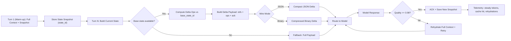

# Token Efficiency Model for Multi-Agent Systems

This package provides a plug in style framework to reduce token usage in multi agent systems (MAS), including compatibility with LLM adapters (e.g., Llama style models).

It implements the tactics for token efficiency:

1. Agent to agent communication compression
2. Smart context pruning
3. Shared memory layer
4. Task aware routing
5. Custom protocol (structured compressed agent language)
6. Combined tactics with an RL orchestrator
7. Stateful `delta` protocol (send diffs + memory references after warm-up)

## Folder Structure

```text
token_efficiency_model/
  agent_communication_compression/
  smart_context_pruning/
  shared_memory_layer/
  task_aware_routing/
  custom_protocol/
  combined_tactics/
  common/
  experiments/
```

## Quick Start

```bash
cd token_efficiency_model
python3 -m venv .venv
source .venv/bin/activate
pip install -r requirements.txt
python experiments/run_simulation.py --episodes 200
python experiments/run_delta_benchmark.py
```

## What the Simulation Measures

- Baseline tokens: raw multi-agent transfer
- Optimized tokens: after all tactics
- Token savings (%): efficiency gain
- Quality proxy: estimated task quality after compression/pruning/routing
- RL reward: quality-aware token efficiency objective
- Steady-state tokens: token usage after cache warm-up
- Cold-start tokens: first-turn token cost
- Cache hit rate / rehydration events: delta-path reliability

## Delta Mode (Near-Zero Steady State)

`TokenEfficientPipeline` now supports stateful delta communication:

- `delta_mode="state-delta"`: sends only diff operations against prior state
- `delta_aggressiveness`: controls diff compactness
- `wire_mode="json" | "binary"`: JSON by default, optional compressed binary wire payload
- Quality floor enforcement (default `0.98`) with automatic rehydration fallback

## Architecture Diagrams

### Full Pipeline Flow

Live FigJam: [Token Efficiency MAS Flow](https://www.figma.com/online-whiteboard/create-diagram/b400cd26-7735-4d58-b5f9-b188fbdba794?utm_source=other&utm_content=edit_in_figjam&oai_id=&request_id=97355c5e-11f3-4335-aaae-f4b50d8b8195)

```mermaid
flowchart LR
  A["Task Input"] --> B["Agent Communication Compression"]
  B --> C["Smart Context Pruning"]
  C --> D["Shared Memory Layer"]
  D --> E{"State Exists?"}
  E -->|"No"| F["Full Payload Build"]
  E -->|"Yes"| G["Delta Ops Builder"]
  G --> H["Custom Protocol Encode"]
  F --> H
  H --> I{"Wire Mode"}
  I -->|"JSON"| J["JSON Payload"]
  I -->|"Binary"| K["Compressed Binary Payload"]
  J --> L["Task-Aware Routing"]
  K --> L
  L --> M{"Small or Large Model"}
  M --> N["Model Backend (Llama/Ollama/API)"]
  N --> O["Quality Floor Check >= 0.98"]
  O -->|"Pass"| P["Save Snapshot + ACK State"]
  O -->|"Fail"| Q["Rehydrate Full Context"]
  Q --> N
  P --> R["Telemetry: Savings, Steady Tokens, Cache Hit"]
```



### Delta Path Focus Flow

Live FigJam: [Delta Path Focus Flow](https://www.figma.com/online-whiteboard/create-diagram/0fb9105a-3784-47f4-82f3-63af48be133e?utm_source=other&utm_content=edit_in_figjam&oai_id=&request_id=227837c1-ccb5-4d0c-b84e-68693a64bf42)



## Plugging Into Real LLMs (Llama, etc.)

Use `combined_tactics.pipeline.TokenEfficientPipeline` with any callable model backend:

```python
def llama_backend(prompt: str, model_name: str) -> str:
    # call your Llama endpoint/client here
    return "model output"

pipeline = TokenEfficientPipeline(model_backend=llama_backend)
result = pipeline.process_task(
    task_text="Summarize security implications of this design.",
    incoming_messages=["agentA: ...", "agentB: ..."],
    prior_context=["system constraints...", "past decision..."],
  delta_mode="state-delta",
  delta_aggressiveness=2,
  wire_mode="json",
)
```

## Notes

- This implementation is lightweight and pure Python (standard library + NumPy).
- The RL module uses tabular Q-learning over tactic-control decisions.
- You can replace the simulation quality proxy with real downstream eval metrics.
